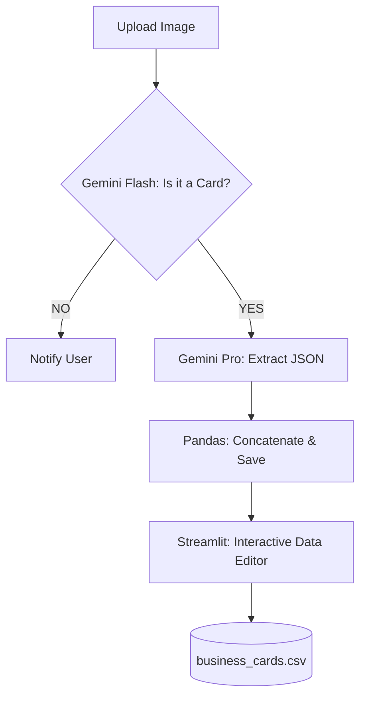

# 📇 Business Card Extractor

An intelligent **Vision-AI** application that automates the extraction of contact information from business card images. Powered by **Gemini 1.5 Pro/Flash**, this tool transforms unstructured images into structured **JSON** and **CSV** formats with a professional, interactive UI.

---

## 🏗️ System Architecture

The application utilizes a **Multimodal OCR & Vision Reasoning** architecture, where an LLM acts as the primary data extractor and validator.

### 1. Vision Analysis Layer
* **Multimodal Processing:** Uses `Gemini-1.5-Flash` to perform a preliminary "sanity check" to determine if an uploaded image is actually a business card.
* **Semantic Extraction:** Uses `Gemini-1.5-Pro` to parse complex layouts. Unlike traditional OCR, it understands context (e.g., distinguishing between a company name and a person's name based on positioning).

### 2. Storage & Orchestration Layer
* **Persistent CSV:** Maintains a local `business_cards.csv` that appends new data sessions to existing records.
* **Session State Management:** Uses Streamlit's `session_state` to keep extracted JSON data accessible for live viewing without re-triggering expensive API calls.
* **File I/O:** Manages an automated `uploaded_images` directory for batch processing.

### 3. Interactive Data Layer
* **Dynamic Editor:** Integrated with `st.data_editor`, allowing users to manually correct AI extraction errors before final CSV commitment.
* **Grid Visualization:** Renders uploaded images in a multi-column responsive grid using **PIL (Pillow)**.

---

## 🛠️ Tech Stack

| Component | Technology |
| :--- | :--- |
| **LLM / Vision** | Google Gemini 1.5 (Pro & Flash) |
| **Framework** | LangChain & Streamlit |
| **Image Handling** | PIL (Pillow) |
| **Data Engine** | Pandas & CSV |
| **Schema Control** | Python `ast` (Literal Evaluation) |

---

## 🧠 Logic & Workflow

1.  **Ingestion:** User uploads batch images or selects from the existing "vault."
2.  **Validation:** Flash-based vision check returns `YES/NO` to filter out non-card images.
3.  **Extraction:** Pro-based vision prompt requests a strictly formatted JSON array:
    ```json
    [{"Person name": "...", "Company name": "...", "Email": "...", "Contact number": "..."}]
    ```
4.  **Transformation:** The system handles multi-name cards (e.g., "Person name 2") and flattens them into a unified CSV schema.
5.  **Audit:** The user reviews raw JSON and edits the live DataFrame to ensure 100% accuracy.

---

## 📊 Technical Specification

### Vision Prompting Strategy
The system uses a "Clean Output" instruction set to prevent the LLM from returning markdown blocks (like \` \` \`json), which allows for direct parsing into Python dictionaries using `ast.literal_eval`.

### CSV Persistence Logic
```python
if csv_exists:
    existing_df = pd.read_csv(csv_filename)
    df = pd.concat([existing_df, df], ignore_index=True)
df.to_csv(csv_filename, index=False)
```
This ensures that the application behaves like a database, growing with every processed card.

---

### 📈 Process Flow



---
**Note:** *Ensure a valid Google API Key is provided. This tool is designed for bulk processing with built-in error handling for API timeouts and invalid image formats.*
